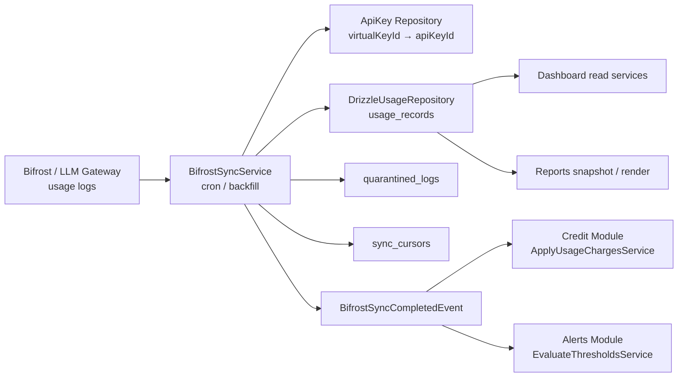
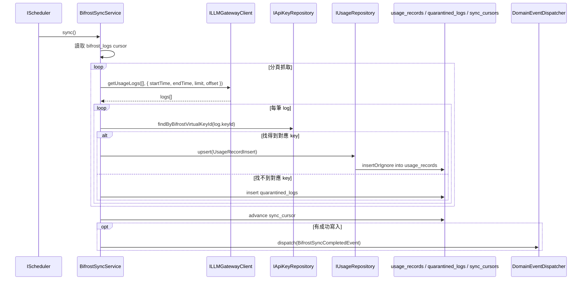

# Bifrost Usage Sync 資料流：Gateway → Usage Read Model → 下游消費者

**適用對象**：後端、架構審閱者、測試、維運  
**相關模組**：`src/Modules/Dashboard`、`src/Modules/Credit`、`src/Modules/Alerts`、`src/Modules/Reports`

這份文件描述目前版本中「排程向 Bifrost / LLM Gateway 取得用量資料，並寫入本地 `usage_records`」的實作情況。

## 結論先講

這條功能**已實作**，而且是目前系統資料管線的一部分：

- Scheduler 會定期觸發 `BifrostSyncService.sync()`
- `BifrostSyncService` 會向 gateway 抓 usage logs
- 每筆 log 會被映射為 `UsageRecordInsert`
- 成功資料會寫入本地 `usage_records`
- 無法對應的 log 會進 `quarantined_logs`
- 同步完成後會發 `BifrostSyncCompletedEvent`
- Credit 與 Alerts 透過事件接續處理
- Dashboard 與 Reports 後續只讀本地 usage read model，不需要直接打 gateway

---

## 1. 資料流總覽

### 解讀

- **Gateway** 是原始資料來源
- **Sync** 是 ingestion / 落庫層
- **UsageRepo** 是本地 read model
- **Dashboard / Reports** 是下游消費者
- **Credit / Alerts** 則主要靠事件驅動往下跑

---

## 2. 目前實作的同步流程

### 這段程式的責任邊界

#### `BifrostSyncService`
負責：
- 讀 cursor
- 呼叫 gateway
- 分頁抓取
- 解析 API key
- 寫入 usage repo
- quarantine 失敗 log
- 推進 cursor
- 發送同步完成事件

#### `DrizzleUsageRepository`
負責：
- 將 usage log 寫進本地 `usage_records`
- 提供聚合查詢給 Dashboard / Reports / Alerts

#### `IApiKeyRepository`
負責：
- 把 gateway 的 `virtualKeyId` 對回本地 `apiKeyId`

#### `DomainEventDispatcher`
負責：
- 把同步完成結果傳給下游模組

---

## 3. 寫入行為與保護機制

### 已有的保護

| 保護機制 | 實作情況 |
|---|---|
| 分頁 | 已實作，單頁大小 `500` |
| 最大頁數 | 已實作，`MAX_SYNC_PAGES = 50`，避免 runaway loop |
| 逾時保護 | 已實作，單次 sync 30 秒 timeout |
| 冪等寫入 | 已實作，`usage_records` 以 `bifrost_log_id` 去重 |
| 無法對應 key 的處理 | 已實作，寫入 `quarantined_logs` |
| cursor 推進 | 已實作，只在 sync 流程成功完成後推進 |
| 同步完成事件 | 已實作，`BifrostSyncCompletedEvent` |

### 目前可觀察到的行為

- 找不到 key 的 log 不會中斷整批同步
- gateway 失敗會讓這次 sync 退回為空結果，交由下一輪再跑
- quarantine 失敗不會反過來讓 sync 崩掉

---

## 4. 下游消費者如何使用這些資料

### 4.1 Dashboard

Dashboard 的多數查詢服務直接讀 `IUsageRepository`：

- `GetAdminPlatformUsageTrendService`
- `GetKpiSummaryService`
- `GetCostTrendsService`
- `GetModelComparisonService`
- `GetPerKeyCostService`

這些服務的資料來源是本地 `usage_records` 聚合，不是 gateway live call。

### 4.2 Reports

報表模板 render 流程會：

1. 驗 token
2. 讀 schedule
3. 用 `buildReportSnapshot(...)` 查本地 usage read model
4. 把 snapshot props 傳給前端模板

因此報表 render 也是讀本地資料，不直接打 gateway。

### 4.3 Credit

`BifrostSyncCompletedEvent` 會觸發 `ApplyUsageChargesService`，對尚未扣款的 `usage_records` 做後續扣費。

這表示：

- usage ingestion 與 credit deduction 是解耦的
- 同步完成事件是銜接點

### 4.4 Alerts

Alerts 也會消費 `BifrostSyncCompletedEvent`，再評估閾值並投遞通知。

---

## 5. 目前版本的實作狀態

| 子功能 | 狀態 | 備註 |
|---|---|---|
| cron 定時同步 | 已實作 | `DashboardServiceProvider.registerJobs()` |
| gateway 拉取 usage logs | 已實作 | `ILLMGatewayClient.getUsageLogs(...)` |
| 對應本地 API key | 已實作 | `findByBifrostVirtualKeyId(...)` |
| 寫入 `usage_records` | 已實作 | `DrizzleUsageRepository.upsert(...)` |
| quarantine 不可辨識 log | 已實作 | `quarantined_logs` |
| sync cursor 推進 | 已實作 | `sync_cursors` |
| sync 完成事件 | 已實作 | `BifrostSyncCompletedEvent` |
| backfill 補抓 | 已實作 | `BifrostSyncService.backfill(...)` |
| 直接讓報表 render 打 gateway | **未做，且不需要** | 報表讀本地 usage read model |

---

## 6. 與其他資料流的關係

### 這條不是報表 render 路徑

報表 render 的資料來源文件請看：

- [`report-rendering-data-flow.md`](./report-rendering-data-flow.md)

### 這條也不是 API 在線代理路徑

在線 API 代理到 Bifrost 的流程屬於另一條路徑，主要在 `SdkApi` / Gateway 模組。

### 這條是 usage ingestion pipeline

它的定位是：

- **從外部 gateway 收原始 usage**
- **轉成本地 read model**
- **讓下游模組只讀本地資料**

---

## 7. 實作位置索引

| 程式碼 | 責任 |
|---|---|
| `src/Modules/Dashboard/Infrastructure/Services/BifrostSyncService.ts` | 同步主流程 |
| `src/Modules/Dashboard/Infrastructure/Providers/DashboardServiceProvider.ts` | 排程註冊 |
| `src/Modules/Dashboard/Infrastructure/Repositories/DrizzleUsageRepository.ts` | usage read model 寫入 / 查詢 |
| `src/Modules/Dashboard/Application/Ports/IUsageRepository.ts` | usage read model 介面 |
| `src/Modules/Dashboard/Application/DTOs/UsageLogDTO.ts` | gateway log 的對應型別說明 |
| `src/Modules/Dashboard/Domain/Events/BifrostSyncCompletedEvent.ts` | 同步完成事件 |
| `src/Modules/Credit/Application/Services/ApplyUsageChargesService.ts` | 同步後扣款 |
| `src/Modules/Alerts/Application/Services/EvaluateThresholdsService.ts` | 同步後告警評估 |

---

## 8. 結論

目前這個功能不是構想，而是**已經實作並串起來**的 ingestion pipeline：

- cron 會抓 gateway
- gateway 資料會寫進 `usage_records`
- 下游會讀本地資料，不需要每次都打 gateway

如果後續要做的是「更嚴格的 immutable snapshot」或「更細的分模組 usage 追蹤」，那會是新一輪設計，不是這條 pipeline 的既有行為。

**最後更新**：2026-04-22
