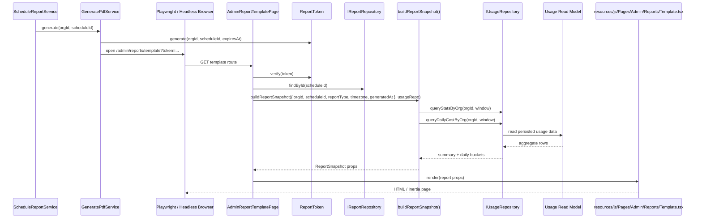
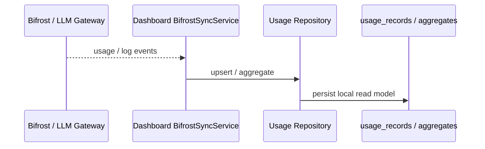

# 報表模板渲染資料流：不是直接打 Gateway

**適用對象**：後端、前端、測試、架構審閱者  
**相關模組**：`src/Modules/Reports`、`src/Modules/Dashboard`、`src/Website/Admin`

這份文件用來釐清目前版本的報表模板渲染流程：

- **不是**在 render 時直接向外部 Bifrost / LLM gateway 查詢
- **是**先驗證短效 token，再讀取本地已持久化的 schedule 與 usage read model
- 前端 `resources/js/Pages/Admin/Reports/Template.tsx` 只負責把 server props 畫出來

換句話說，報表頁面的即時性來自 **後端本地資料庫 / read model 的即時查詢**，不是來自直接打 gateway。

---

## 一句話結論

`/admin/reports/template` 的 render 路徑會讀：

1. `ReportToken`：本地簽章驗證
2. `IReportRepository`：讀 schedule metadata
3. `IUsageRepository`：讀 usage read model
4. `resources/js/.../Template.tsx`：只接 props 畫畫面

**不會**在這條 render 路徑上直接呼叫 gateway。

---

## 資料來源分層

| 資料來源 | 讀取時機 | 來源類型 | 是否直接打 gateway |
|---|---|---|---|
| `REPORT_SIGNING_SECRET` | token 驗證時 | 環境變數 / 本地簽章 | 否 |
| `report_schedules` / `IReportRepository` | 模板 render 前 | 本地持久化資料 | 否 |
| `usage_records` / `IUsageRepository` | 模板 render 中 | 本地 read model | 否 |
| React Inertia props | 模板 render 時 | server props | 否 |
| Bifrost / LLM gateway | **不在此 render 路徑** | 外部服務 | **否** |

### 這裡的「即時」是什麼意思？

這版的「即時」指的是：

- 每次 render 都會查 **最新的本地 schedule**
- 每次 render 都會查 **最新的本地 usage 聚合**

所以它是 **live lookup on persisted data**，不是從外部 gateway 現抓。

---

## 主流程：報表模板 render

### 實際責任邊界

- `GeneratePdfService`
  - 只負責產 token、開啟模板 URL、觸發 PDF render
- `AdminReportTemplatePage`
  - 驗 token
  - 讀 schedule
  - 組 `ReportSnapshot`
- `buildReportSnapshot`
  - 算時間窗
  - 讀 usage read model
  - 組成前端需要的 props
- `Template.tsx`
  - 只畫圖
  - 不再內嵌假資料

---

## 上游背景流程：usage 是怎麼進到本地 read model 的？

這條背景流程**不是**模板 render 的一部分，但它解釋了為什麼 render 時不需要直接打 gateway。

### 重點

- Gateway 只負責產生原始 usage data
- Dashboard sync 負責把資料搬進本地 read model
- Reports render 只讀本地 read model

因此：

- **Report render = 本地查詢**
- **Usage ingestion = gateway upstream**

---

## 目前版本的行為特性

### 1. schedule 是 live lookup

模板 render 時會依 `scheduleId` 讀 `report_schedules`。

這代表：

- schedule 被停用，render 會失敗
- schedule 的 timezone / type 若被修改，render 會反映最新值

這是刻意選擇，目的是讓流程簡單且一致。

### 2. usage 是 read model lookup

報表摘要與趨勢圖來自 `IUsageRepository` 的查詢。

它們不是：

- 直接讀外部 gateway
- 直接讀瀏覽器記憶體
- 前端硬編 sample data

### 3. 前端是純 render

`resources/js/Pages/Admin/Reports/Template.tsx` 目前只吃 server props。

這讓 PDF render 和頁面預覽保持一致，避免前後端各自維護不同假資料。

---

## 如果未來要改成 immutable snapshot

目前版本不是 immutable snapshot。若日後要做到「排程觸發當下的資料，之後 render 永遠不變」，需要另外引入：

- 報表 snapshot 儲存表
- snapshot generation job
- render 時改讀 snapshot，而不是讀 live schedule / usage read model

那會是一個新設計，不應和現在這版的 live lookup 混在一起。

---

## 相關程式位置

| 程式碼 | 責任 |
|---|---|
| `src/Modules/Reports/Application/Services/ScheduleReportService.ts` | 排程觸發與 PDF 流程入口 |
| `src/Modules/Reports/Application/Services/GeneratePdfService.ts` | 產 token、開啟模板 URL |
| `src/Modules/Reports/Presentation/Controllers/ReportController.ts` | 報表 CRUD 與 verify-template |
| `src/Website/Admin/Pages/AdminReportTemplatePage.ts` | 驗 token、查 schedule、組 snapshot |
| `src/Modules/Reports/Application/Services/ReportSnapshot.ts` | 算時間窗、查 usage read model、組 props |
| `src/Modules/Dashboard/.../IUsageRepository.ts` | usage read model 的查詢介面 |
| `resources/js/Pages/Admin/Reports/Template.tsx` | 純 UI render |

---

## 相關文件

- [`architecture/uml/sequence-diagrams.md`](./uml/sequence-diagrams.md)
- [`architecture/uml/activity-diagrams.md`](./uml/activity-diagrams.md)
- [`specs/4-credit-billing/user-stories.md`](../specs/4-credit-billing/user-stories.md)
- [`architecture/website-inertia-layer.md`](./website-inertia-layer.md)

**最後更新**：2026-04-22
