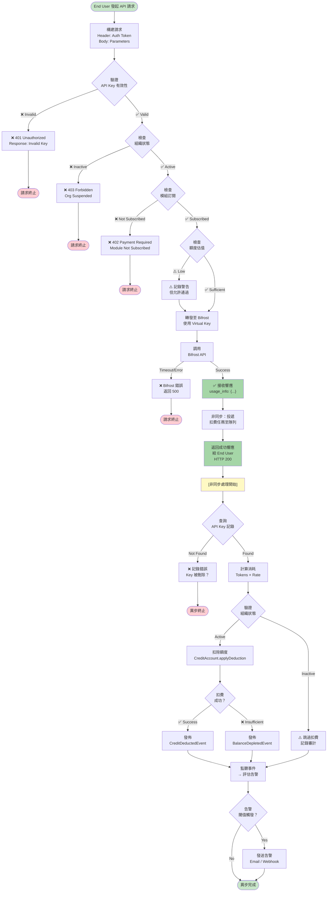
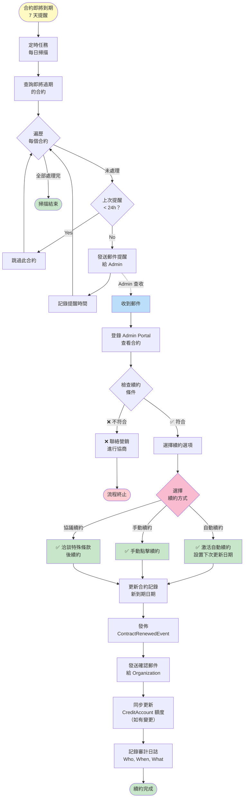
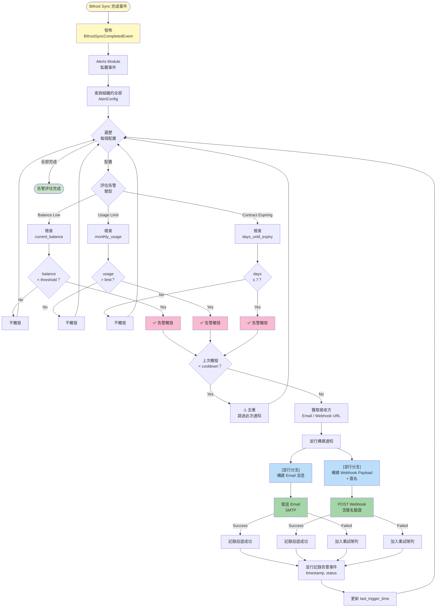
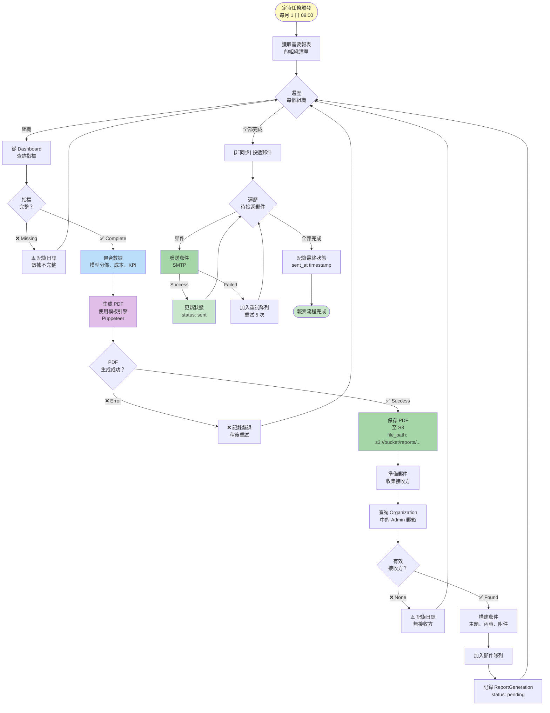
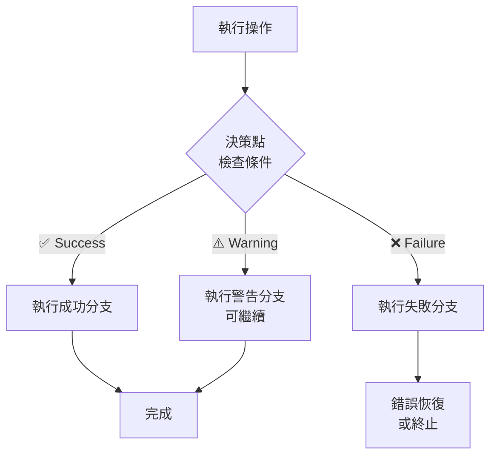

# Draupnir 活動圖（Activity Diagrams）

**文檔版本**: v1.0  
**更新日期**: 2026-04-17  
**目的**: 展現複雜業務流程中的決策分支、並行活動與異常處理路徑

---

## 概述

活動圖適合展現：
- 複雜決策流程（多分支條件判斷）
- 並行活動（多個操作同時進行）
- 異常與恢復路徑
- 業務流程中的等待點

---

## 1. API 請求完整流程（含異常分支）

### 關鍵節點說明

| 節點 | 類型 | 意義 |
|------|------|------|
| **驗證** | 決策 | API Key 有效性、組織狀態、模組訂閱 |
| **轉發** | 同步 | 到 Bifrost 的代理請求 |
| **投遞** | 異步 | 將扣費任務推入後台隊列 |
| **扣費** | 非同步 | 後台任務中的額度計算與扣除 |
| **告警** | 非同步 | 事件驅動的閾值評估與通知 |

---

## 2. 合約續約審批流程

---

## 3. 邀請新成員流程（含邊界情況）

```mermaid
graph TD
    Start([Admin 決定邀請新成員]) --> InputEmail["輸入成員郵箱<br/>選擇角色 Role"]
    
    InputEmail --> ValidateEmail{"驗證<br/>郵箱格式"}
    
    ValidateEmail -->|❌ Invalid| ErrorEmail["❌ 郵箱格式不正確"]
    ErrorEmail --> End1([流程終止])
    
    ValidateEmail -->|✅ Valid| CheckExists{"檢查郵箱<br/>是否已註冊？"}
    
    CheckExists -->|✅ Exist| CheckMember{"該用戶是否<br/>已是成員？"}
    CheckMember -->|Yes| ErrorExists["❌ 用戶已是組織成員"]
    ErrorExists --> End2([流程終止])
    
    CheckMember -->|No| AllowInvite1["✅ 允許邀請<br/>已註冊用戶"]
    
    CheckExists -->|❌ Not Exist| AllowInvite2["✅ 允許邀請<br/>新用戶"]
    
    AllowInvite1 --> GenToken["生成邀請 Token<br/>加密、有效期 30 天"]
    AllowInvite2 --> GenToken
    
    GenToken --> SaveInvite["保存 Invitation<br/>status: pending"]
    
    SaveInvite --> BuildURL["構建邀請連結<br/>https://app.com/invite?token=xxx"]
    
    BuildURL --> RenderEmail["渲染郵件模板<br/>包含邀請連結"]
    
    RenderEmail --> SendEmail["發送郵件<br/>至受邀者"]
    
    SendEmail -->|Success| ConfirmAdmin["✅ 邀請已發送<br/>通知 Admin"]
    SendEmail -->|Failure| RetryQueue["⚠️ 投遞失敗<br/>加入重試隊列"]
    
    RetryQueue --> Retry3Times{"重試<br/>3 次？"}
    Retry3Times -->|Yes| ConfirmAdmin
    Retry3Times -->|No| NotifyAdmin["❌ 郵件投遞失敗<br/>通知 Admin"]
    
    NotifyAdmin --> End3([流程終止])
    ConfirmAdmin --> Wait["⏳ 等待受邀者點擊"]
    
    Wait -.->|Invitee 收到郵件| ClickLink["點擊邀請連結"]
    ClickLink --> CheckToken{"驗證<br/>Token 有效？"}
    
    CheckToken -->|❌ 過期或不存在| ErrorToken["❌ 邀請連結已過期<br/>建議聯絡 Admin"]
    ErrorToken --> End4([流程終止])
    
    CheckToken -->|✅ 有效| CheckUser{"用戶是否<br/>已登錄？"}
    
    CheckUser -->|Yes| DirectAdd["✅ 直接加入組織<br/>無需重新註冊"]
    CheckUser -->|No| RedirectReg["重定向到<br/>註冊頁面"]
    
    RedirectReg --> SignUp["完成新用戶<br/>註冊"]
    
    DirectAdd --> AddMember["將用戶加入組織<br/>role: ${invitedRole}"]
    SignUp --> AddMember
    
    AddMember --> MarkUsed["標記 Invitation<br/>status: completed"]
    
    MarkUsed --> PublishEvent["發佈<br/>MemberInvitedEvent"]
    
    PublishEvent --> SendWelcome["發送歡迎郵件<br/>快速開始指南"]
    
    SendWelcome --> End5([邀請完成])
    
    style Start fill:#c8e6c9
    style ClickLink fill:#bbdefb
    style DirectAdd fill:#a5d6a7
    style SignUp fill:#a5d6a7
    style ErrorEmail fill:#ffcdd2
    style ErrorExists fill:#ffcdd2
    style NotifyAdmin fill:#ffcdd2
    style ErrorToken fill:#ffcdd2
    style End1 fill:#ffcdd2
    style End2 fill:#ffcdd2
    style End3 fill:#ffcdd2
    style End4 fill:#ffcdd2
    style End5 fill:#c8e6c9
```

---

## 4. 告警觸發與通知流程（並行活動）

---

## 5. 報表生成與投遞流程

---

## 6. 活動圖使用指南

### 何時使用活動圖
- ✅ 涉及多個決策點的複雜業務流程
- ✅ 需要展現異常與恢復路徑
- ✅ 涉及並行或異步操作
- ✅ 業務流程梳理與優化

### 如何閱讀
1. **開始點** (`[*]`) — 流程入口
2. **活動節點** (矩形) — 具體操作
3. **決策節點** (菱形) — 條件判斷
4. **分支**（箭頭標籤）— YES/NO 或選項
5. **並行** (平行線) — 多個活動同時執行
6. **結束點** (黑圓 in 白圓) — 流程出口

### 決策最佳實踐

---

## 相關文檔

- [`sequence-diagrams.md`](./sequence-diagrams.md) — 時序圖（展現時間序列）
- [`state-diagrams.md`](./state-diagrams.md) — 狀態圖（展現狀態轉移）
- [`use-case-diagram.md`](./use-case-diagram.md) — 使用案例圖（角色視角）
- [`../knowledge/domain-events.md`](../knowledge/domain-events.md) — 事件驅動設計
