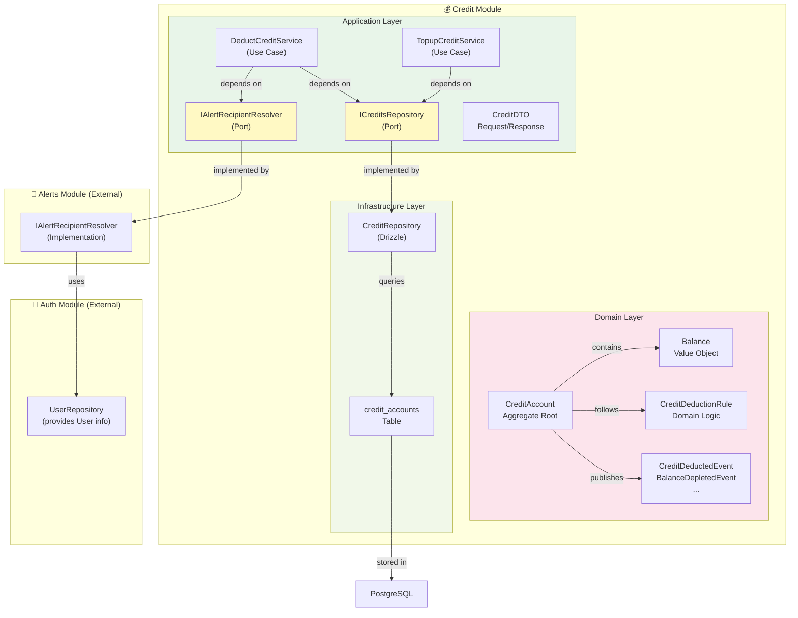
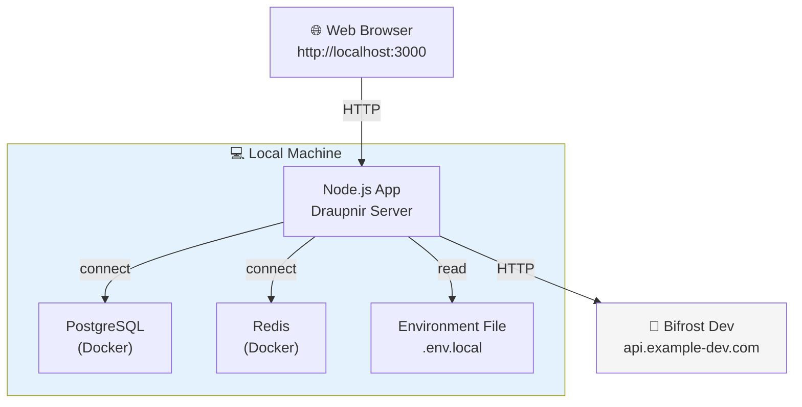
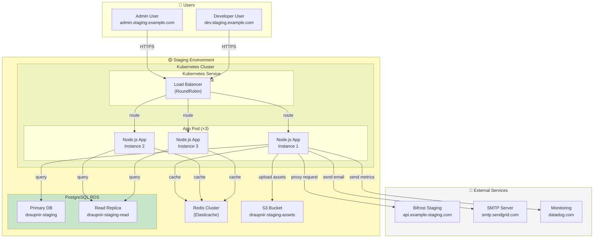
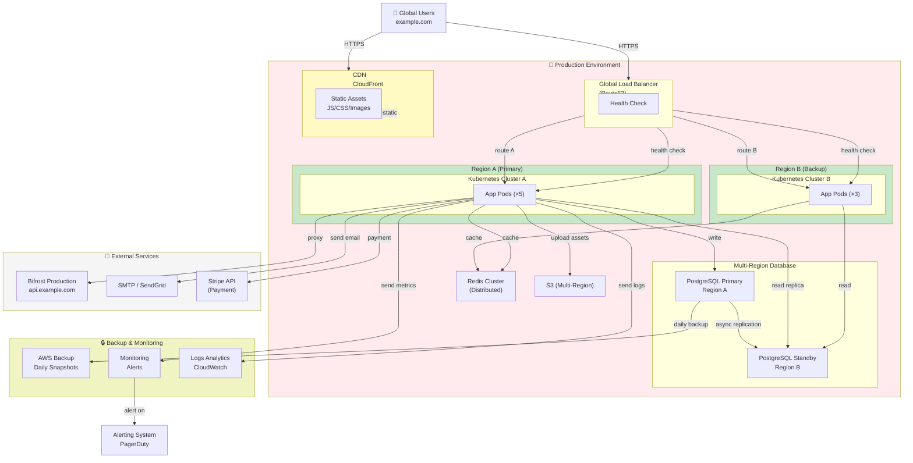

# Draupnir 元件圖與部署圖（Component & Deployment Diagrams）

**文檔版本**: v1.0  
**更新日期**: 2026-04-17  
**目的**: 展現系統元件級細化依賴與運行環境拓撲

---

## 概述

- **元件圖** — 展現每個模組內部的 Domain / Application / Infrastructure 元件邊界與依賴
- **部署圖** — 展現系統在生產環境中的容器化部署、基礎設施依賴、網路拓撲

---

## 第一部分：元件圖（Component Diagram）

### 1. 全系統元件全景圖

```mermaid
graph TB
    subgraph Frontend["🖥️ Frontend (Inertia.js + React)"]
        AdminApp["Admin Portal<br/>src/Website/Admin"]
        DevApp["Developer Portal<br/>src/Website/DevPortal"]
        UserApp["User Portal<br/>src/Website/User"]
    end

    subgraph Gateway["🌐 API Gateway Layer"]
        SdkApiGateway["SdkApi Gateway<br/>POST /sdk/v1/..."]
        CliApiGateway["CliApi Gateway<br/>POST /cli-api/..."]
    end

    subgraph PresentationLayer["📋 Presentation Layer (Controllers & Routes)"]
        AuthCtrl["Auth Controller<br/>routes: /auth, /oauth"]
        ProfileCtrl["Profile Controller<br/>routes: /profile"]
        OrgCtrl["Organization Controller<br/>routes: /org"]
        CreditCtrl["Credit Controller<br/>routes: /credit"]
        ApiKeyCtrl["ApiKey Controller<br/>routes: /keys"]
        AlertsCtrl["Alerts Controller<br/>routes: /alerts"]
        DashCtrl["Dashboard Controller<br/>routes: /dashboard"]
    end

    subgraph AppLayer["🔧 Application Layer (Services)"]
        AuthService["AuthService"]
        ProfileService["ProfileService"]
        OrgService["OrganizationService"]
        CreditService["CreditService"]
        AlertService["AlertService"]
        ReportService["ReportService"]
        WebhookService["WebhookService"]
    end

    subgraph DomainLayer["🎯 Domain Layer (Aggregates & Events)"]
        UserAggregate["User Aggregate"]
        OrgAggregate["Organization Aggregate"]
        CreditAggregate["CreditAccount Aggregate"]
        ContractAggregate["Contract Aggregate"]
        AlertAggregate["AlertConfig Aggregate"]
        DomainEvents["Domain Events<br/>Publisher"]
    end

    subgraph InfrastructureLayer["💾 Infrastructure Layer"]
        UserRepo["UserRepository"]
        OrgRepo["OrganizationRepository"]
        CreditRepo["CreditRepository"]
        ContractRepo["ContractRepository"]
        AlertRepo["AlertRepository"]
        BifrostAdapter["BifrostAdapter<br/>(API Client)"]
        EmailAdapter["EmailAdapter<br/>(SMTP)"]
    end

    subgraph Foundation["🏗️ Foundation Layer (共享基礎設施)"]
        Database["PostgreSQL<br/>Drizzle ORM"]
        Redis["Redis<br/>Cache & Pub/Sub"]
        Logger["Logger<br/>(Pino)"]
        Security["Security<br/>(JWT, HMAC, AES-256)"]
        HealthCheck["Health Check<br/>Module"]
    end

    Frontend -->|HTTP| Gateway
    Frontend -->|HTTP| PresentationLayer

    Gateway -->|validate & proxy| SdkApiGateway
    CliApiGateway -->|proxy to Bifrost| BifrostAdapter

    PresentationLayer -->|depends on| AppLayer

    AuthCtrl -->|calls| AuthService
    ProfileCtrl -->|calls| ProfileService
    OrgCtrl -->|calls| OrgService
    CreditCtrl -->|calls| CreditService
    AlertsCtrl -->|calls| AlertService

    AppLayer -->|depends on| DomainLayer
    AppLayer -->|depends on| InfrastructureLayer

    AuthService -->|uses| UserRepo
    OrgService -->|uses| OrgRepo
    CreditService -->|uses| CreditRepo
    AlertService -->|uses| AlertRepo

    DomainLayer -->|publishes| DomainEvents

    InfrastructureLayer -->|depends on| Foundation

    UserRepo -->|queries| Database
    OrgRepo -->|queries| Database
    CreditRepo -->|queries| Database
    ContractRepo -->|queries| Database
    AlertRepo -->|queries| Database

    AppLayer -->|cache hits| Redis
    BifrostAdapter -->|HTTP| Bifrost["🔌 Bifrost<br/>AI Gateway"]

    EmailAdapter -->|SMTP| ExternalEmail["📧 External<br/>Email Service"]

    style Frontend fill:#e1f5ff
    style Gateway fill:#fff3e0
    style PresentationLayer fill:#f3e5f5
    style AppLayer fill:#e8f5e9
    style DomainLayer fill:#fce4ec
    style InfrastructureLayer fill:#f1f8e9
    style Foundation fill:#ede7f6
```



### 2. 單個模組的元件細化圖（以 Credit 模組為例）



### 3. 跨模組依賴元件圖

```mermaid
graph TB
    subgraph Auth["🔐 Auth<br/>Provides: User, AuthToken"]
        AuthPort["IUserRepository<br/>IAuthTokenRepository"]
    end

    subgraph Profile["👤 Profile<br/>Provides: UserProfile"]
        ProfilePort["IUserProfileRepository"]
    end

    subgraph Organization["👥 Organization<br/>Provides: Organization, Member"]
        OrgPort["IOrganizationRepository<br/>IMemberRepository"]
    end

    subgraph Credit["💰 Credit<br/>Provides: CreditAccount"]
        CreditPort["ICreditRepository"]
    end

    subgraph Contract["📜 Contract<br/>Provides: Contract"]
        ContractPort["IContractRepository"]
    end

    subgraph Alerts["🚨 Alerts<br/>Provides: AlertConfig"]
        AlertPort["IAlertConfigRepository<br/>IAlertRecipientResolver"]
    end

    subgraph AppModule["📦 AppModule<br/>Provides: AppModule Subscription"]
        ModulePort["IAppModuleRepository"]
    end

    subgraph Dashboard["📊 Dashboard<br/>Provides: Usage Metrics (Read Model)"]
        DashPort["IUsageRepository<br/>IMetricsRepository"]
    end

    subgraph DevPortal["🛠️ DevPortal<br/>Provides: Application, Webhook"]
        DevPort["IApplicationRepository<br/>IWebhookRepository"]
    end

    subgraph SdkApi["🌐 SdkApi Gateway"]
        SdkApiCheck["SdkApi Middleware<br/>verify key → check org → check module"]
    end

    SdkApiCheck -->|depends on| AuthPort
    SdkApiCheck -->|depends on| OrgPort
    SdkApiCheck -->|depends on| ModulePort
    SdkApiCheck -->|depends on| CreditPort
    SdkApiCheck -->|depends on| ContractPort

    Alerts -->|depends on| CreditPort
    Alerts -->|depends on| AlertPort
    AlertPort -->|resolves recipients from| AuthPort
    AlertPort -->|resolves recipients from| OrgPort

    Dashboard -->|depends on| CreditPort
    Dashboard -->|depends on| ContractPort
    Dashboard -->|depends on| AuthPort

    DevPortal -->|depends on| OrgPort
    DevPortal -->|depends on| AuthPort
    DevPortal -->|depends on| DevPort

    AppModule -->|depends on| OrgPort
    AppModule -->|depends on| ModulePort

    Contract -->|depends on| CreditPort
    Contract -->|depends on| OrgPort

    style Auth fill:#c8e6c9
    style Profile fill:#c8e6c9
    style Organization fill:#c8e6c9
    style Credit fill:#ffccbc
    style Contract fill:#ffccbc
    style Alerts fill:#f8bbd0
    style AppModule fill:#e1bee7
    style Dashboard fill:#bbdefb
    style DevPortal fill:#c5cae9
    style SdkApi fill:#fff9c4
```



---

## 第二部分：部署圖（Deployment Diagram）

### 1. 本地開發環境



### 2. 預發佈（Staging）環境



### 3. 生產環境（Production）



### 4. 部署架構決策表

| 層級 | 本地開發 | Staging | Production |
|------|--------|---------|-----------|
| **容器化** | Docker Compose | Kubernetes | Kubernetes (×2 Region) |
| **App 副本** | ×1 | ×3 | ×5 + ×3（備用） |
| **數據庫** | SQLite/Docker | RDS Single | RDS Multi-Region + Failover |
| **緩存** | Redis Docker | Elasticache | Redis Cluster (Distributed) |
| **CDN** | ❌ | CloudFront | CloudFront (Global) |
| **負載均衡** | ❌ | ALB | Route53 + ALB |
| **監控** | Local Logs | Datadog | Datadog + CloudWatch |
| **備份** | Manual | Weekly | Daily + Continuous |
| **SLA** | N/A | 99.5% | 99.99% |

---

## 第三部分：通訊協議與數據流

### 1. 網路通訊層

```
HTTPS (TLS 1.3)
├─ Client ↔ Load Balancer (+ WAF)
├─ Load Balancer ↔ App Pod
├─ App ↔ Database (Private Subnet)
├─ App ↔ Redis (Private Subnet)
├─ App ↔ Bifrost (External API, signed request)
├─ App ↔ Email Service (SMTP + Auth)
└─ App ↔ Monitoring (Datadog Agent)
```

### 2. 環境變數與配置管理

| 環境 | 存儲位置 | 加密 | 重載 |
|------|--------|------|------|
| **本地開發** | `.env.local` 文件 | ❌ | 手動 + 監聽 |
| **Staging** | AWS Secrets Manager | ✅ AES-256 | 自動（每分鐘掃描） |
| **Production** | AWS Secrets Manager | ✅ AES-256 | 自動（每分鐘掃描） |

### 3. 關鍵部署清單

```yaml
Pre-Deployment:
  - [ ] 代碼通過 CI/CD 測試（自動化）
  - [ ] 數據庫遷移計畫已評審
  - [ ] 環境變數已配置至目標環境
  - [ ] 備份已完成
  - [ ] 監控告警已配置
  - [ ] 回滾計畫已準備

Deployment:
  - [ ] 使用 Blue-Green 或 Canary 策略部署
  - [ ] 健康檢查通過（×3 個檢查點）
  - [ ] 冒煙測試通過（Smoke Test）
  - [ ] 監控指標正常

Post-Deployment:
  - [ ] 驗證端點可訪問
  - [ ] 關鍵流程測試通過（API、Auth、Payment）
  - [ ] 日誌中無 ERROR
  - [ ] 用戶報告無異常
  - [ ] 部署完成通知
```

---

## 相關文檔

- [`ddd-layered-architecture.md`](./ddd-layered-architecture.md) — 15 個模組的分層結構
- [`module-dependency-map.md`](./module-dependency-map.md) — 模組間依賴矩陣
- [`DEVELOPMENT.md`](../DEVELOPMENT.md) — 開發環境配置與命令
- [`../knowledge/coding-conventions.md`](../knowledge/coding-conventions.md) — 代碼規範
