# Draupnir 時序圖（Sequence Diagrams）

**文檔版本**: v1.0  
**更新日期**: 2026-04-22  
**目的**: 展現關鍵業務流程的時間順序與組件交互

---

## 概述

本文檔覆蓋 Draupnir 的核心業務流程時序圖。認證流程見 [`auth-flow-diagrams.md`](./auth-flow-diagrams.md)。

---

## 1. API 請求與計費流程（SDK/CliApi Gateway）

### 流程概述
End User 發起 API 請求 → 驗證 → 轉發至 Bifrost → 非同步扣費 → 告警評估

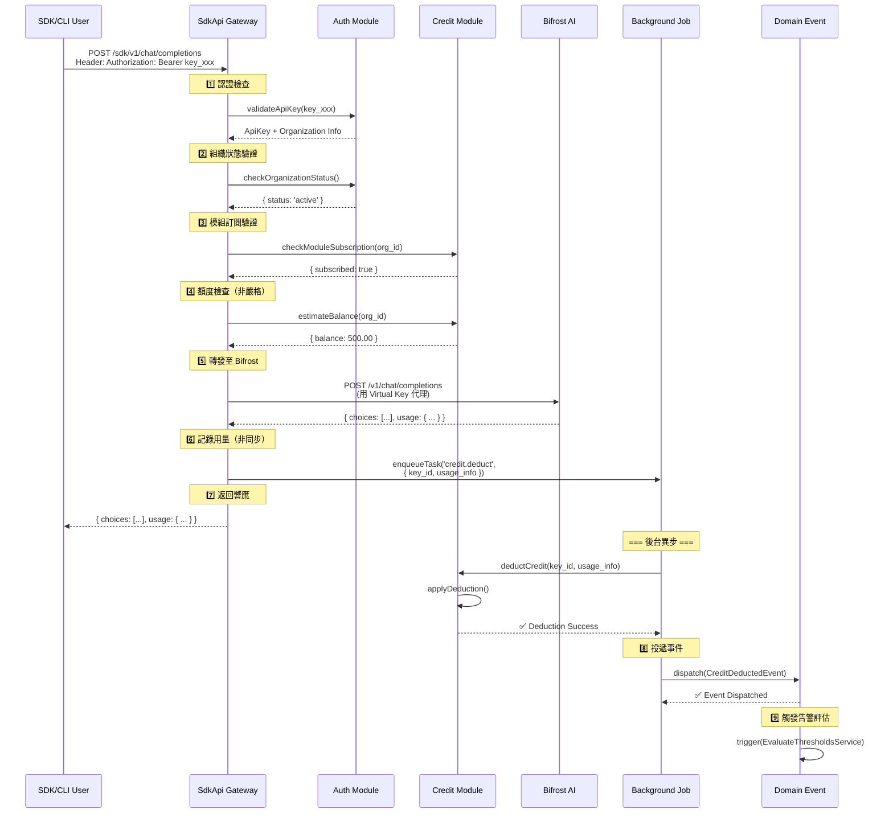

### 關鍵特性

| 階段 | 操作 | 同步/非同步 | 對應模組 |
|------|------|-----------|---------|
| **驗證** | API Key 有效性 | 同步 | Auth, ApiKey |
| **檢查** | 組織狀態、模組訂閱、額度預估 | 同步 | Auth, Credit, AppModule |
| **轉發** | 代理至 Bifrost Virtual Key | 同步 | SdkApi, Bifrost |
| **扣費** | 扣除額度、記錄審計日誌 | **非同步** | Credit, Background Job |
| **通知** | 投遞事件、觸發告警評估 | **非同步** | Domain Event, Alerts |

### 錯誤場景

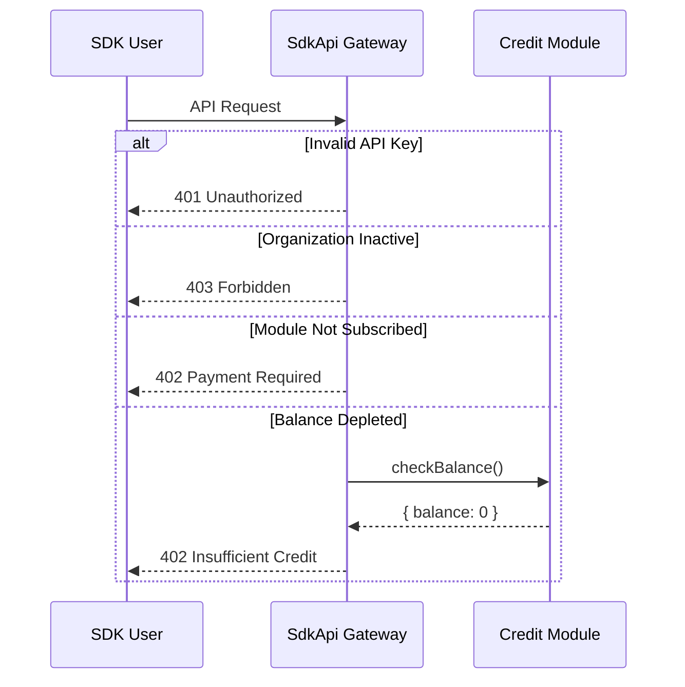

---

## 2. Bifrost 用量同步與落庫流程

### 流程概述
Scheduler → Bifrost Gateway → 映射本地 API Key → 寫入 `usage_records` → 發出同步完成事件

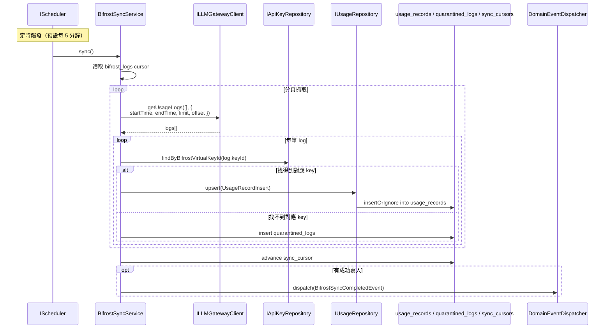

### 關鍵特性

| 階段 | 操作 | 同步/非同步 | 對應模組 |
|------|------|-----------|---------|
| **抓取** | 透過 `ILLMGatewayClient.getUsageLogs()` 拉取原始 usage logs | 同步 | Dashboard, Gateway |
| **映射** | 以 `virtualKeyId` 解析本地 `apiKeyId` | 同步 | Dashboard, ApiKey |
| **入庫** | 寫入 `usage_records` / `quarantined_logs` / `sync_cursors` | 同步 | Dashboard |
| **通知** | 發佈 `BifrostSyncCompletedEvent` | 非同步 | Domain Event, Credit, Alerts |

### 錯誤場景

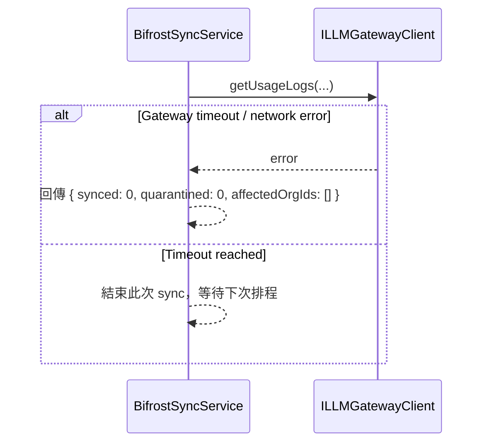

---

## 3. 告警評估與通知流程

### 流程概述
Bifrost 同步完成 → 監聽事件 → 掃描告警配置 → 評估閾值 → 觸發通知

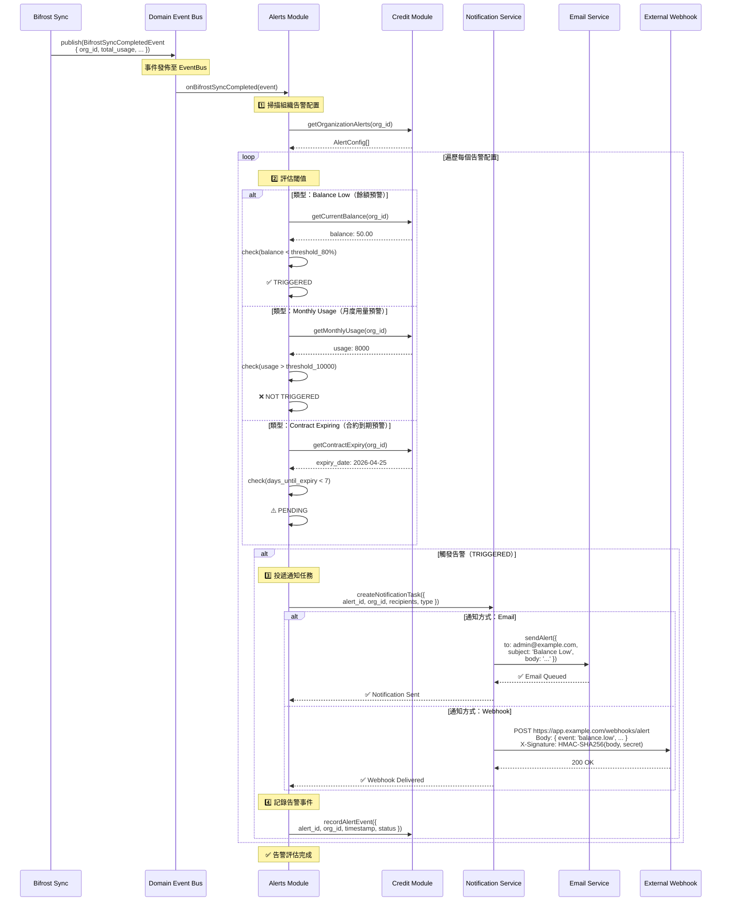

### 觀察者模式（Webhook 簽名驗證）

外部應用接收到 Webhook 時的驗證流程：

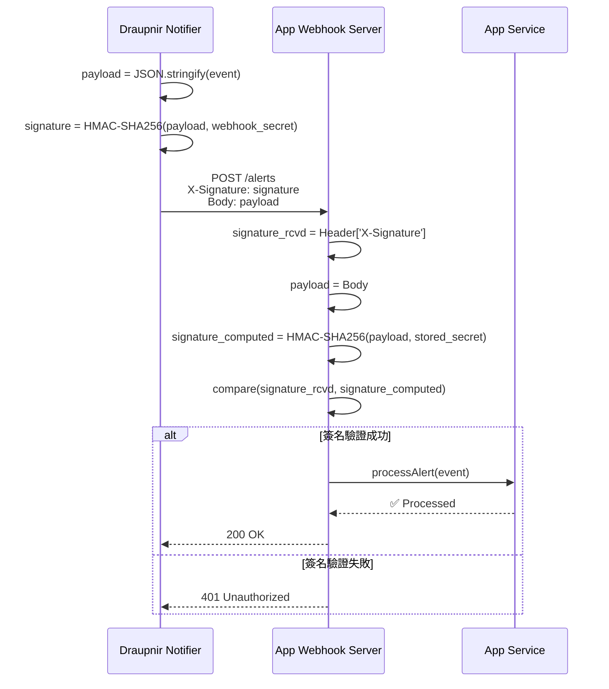

### 告警狀態轉移

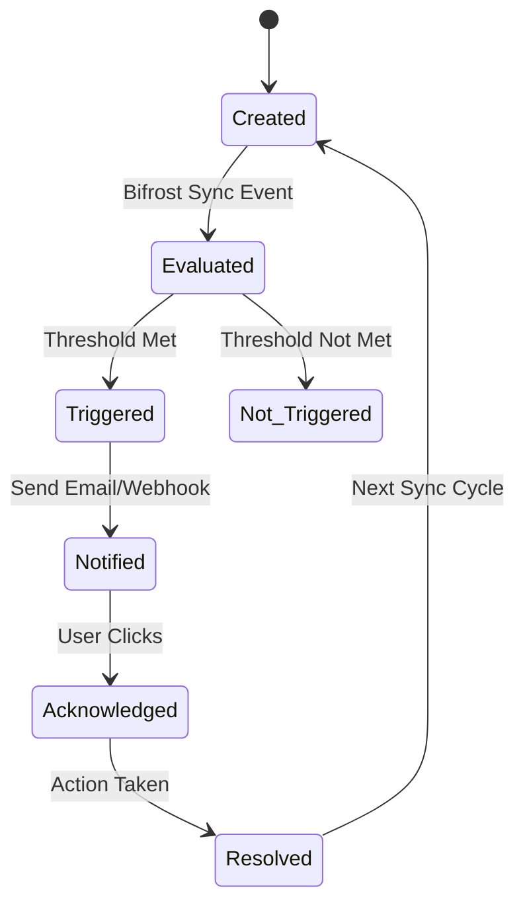

---

## 4. 報表生成與投遞流程

### 流程概述
定時任務 → 聚合指標 → 生成 PDF → 發送郵件

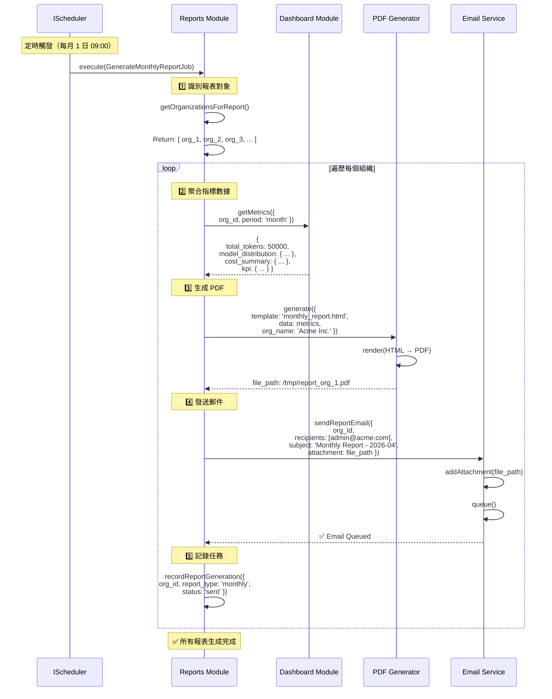

### 報表模板結構

```
Monthly Report Template
├─ 標題：Draupnir Usage Report - 2026-04
├─ 摘要：
│  ├─ 計費期間：2026-04-01 ~ 2026-04-30
│  ├─ 組織名稱：Acme Inc.
│  ├─ 總消耗 Token：50,000
│  └─ 月度成本：$250
├─ 模型分佈（圖表）
├─ 成本趨勢（曲線圖）
├─ KPI：
│  ├─ Tokens/Day：~1,667
│  ├─ Cost/Million-Token：$5.00
│  └─ Peak Usage Hour：14:00
└─ 建議：
   ├─ 若用量持續增長，考慮升級計畫
   └─ 可通過 API 優化減少無效調用
```

---

## 5. 成員邀請流程

### 流程概述
生成邀請 Token → 發送郵件 → 點擊驗證 → 自動加入組織

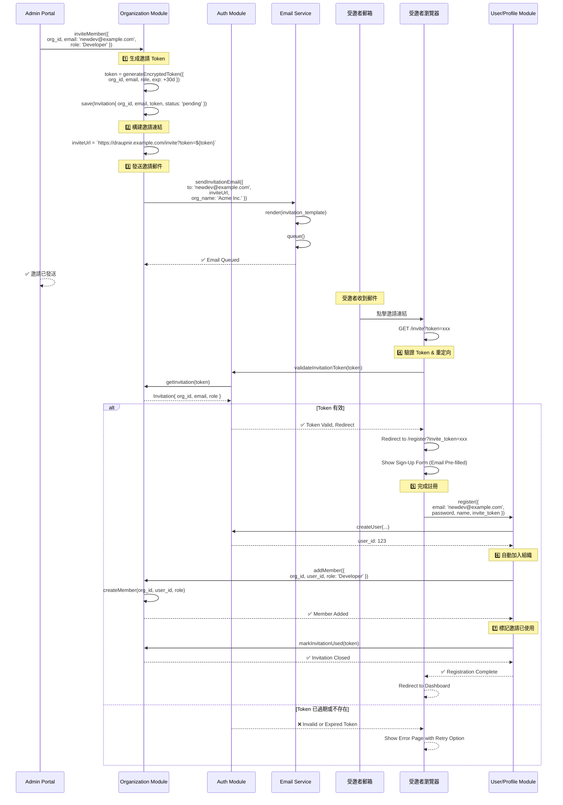

### 邀請狀態流轉

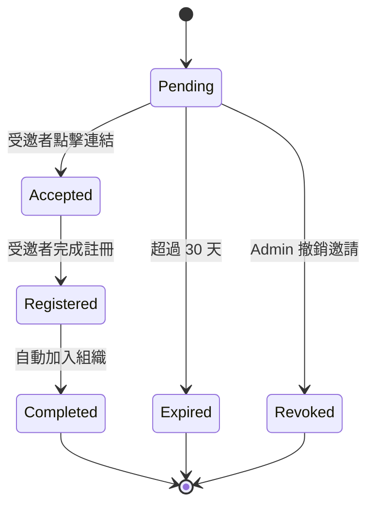

---

## 6. 合約到期與續約流程

### 流程概述
檢測合約即將過期 → 發送提醒 → Admin 續約 → 更新有效期

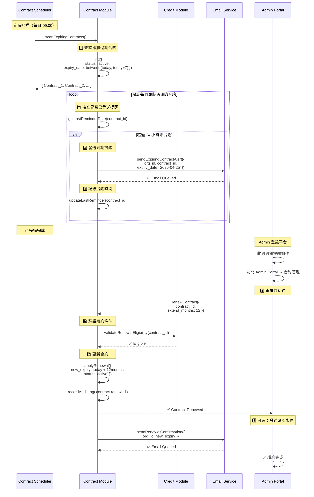

---

## 6. 時序圖使用指南

### 何時使用時序圖
- ✅ 理解跨模組的同步/非同步交互
- ✅ 設計新功能時梳理時間順序
- ✅ 故障排查與性能優化
- ✅ 開發者入職培訓

### 如何閱讀
1. **縱軸** = 參與者（Actor、Module、Service）
2. **橫軸** = 時間線
3. **箭頭** = 調用關係（實線 = 同步，虛線 = 異步返回）
4. **標籤** = 方法名、參數、返回值

### 異步任務模式

本系統大量使用**後台異步任務**以降低主路徑延遲：

| 場景 | 同步 | 異步 | 原因 |
|------|------|------|------|
| API 請求 → 轉發 Bifrost | ✅ | ❌ | 用戶須等待響應 |
| API 請求 → 扣費記錄 | ❌ | ✅ | 無需阻塞主路徑 |
| 告警評估 | ❌ | ✅ | 耗時聚合操作 |
| 報表生成 | ❌ | ✅ | 長耗時 PDF 生成 |
| 郵件投遞 | ❌ | ✅ | 可重試機制 |

---

## 相關文檔

- [`auth-flow-diagrams.md`](./auth-flow-diagrams.md) — JWT、OAuth、API Key 認證流程
- [`ddd-layered-architecture.md`](./ddd-layered-architecture.md) — 模組結構
- [`domain-events.md`](../knowledge/domain-events.md) — Domain Events 實踐
- [`use-case-diagram.md`](./use-case-diagram.md) — 使用案例圖
