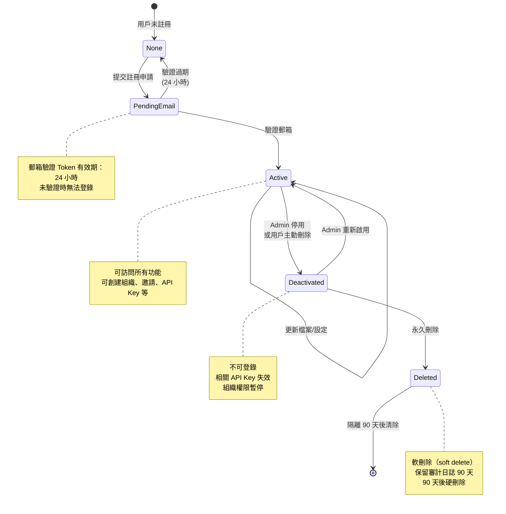
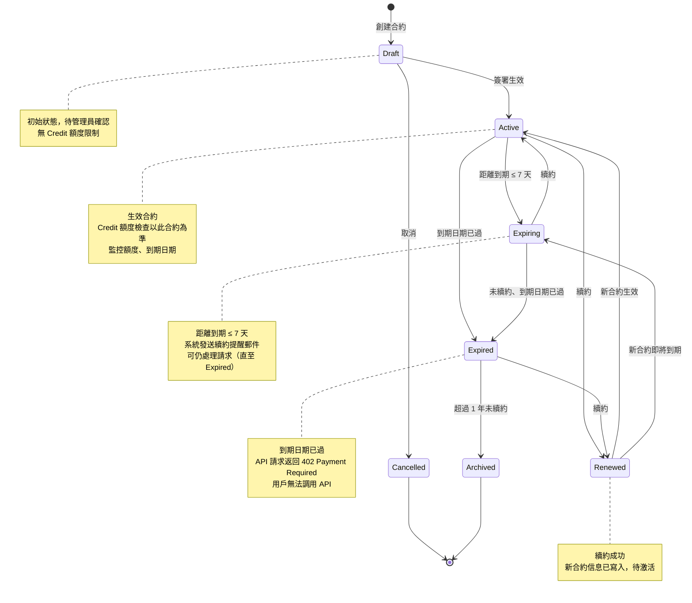
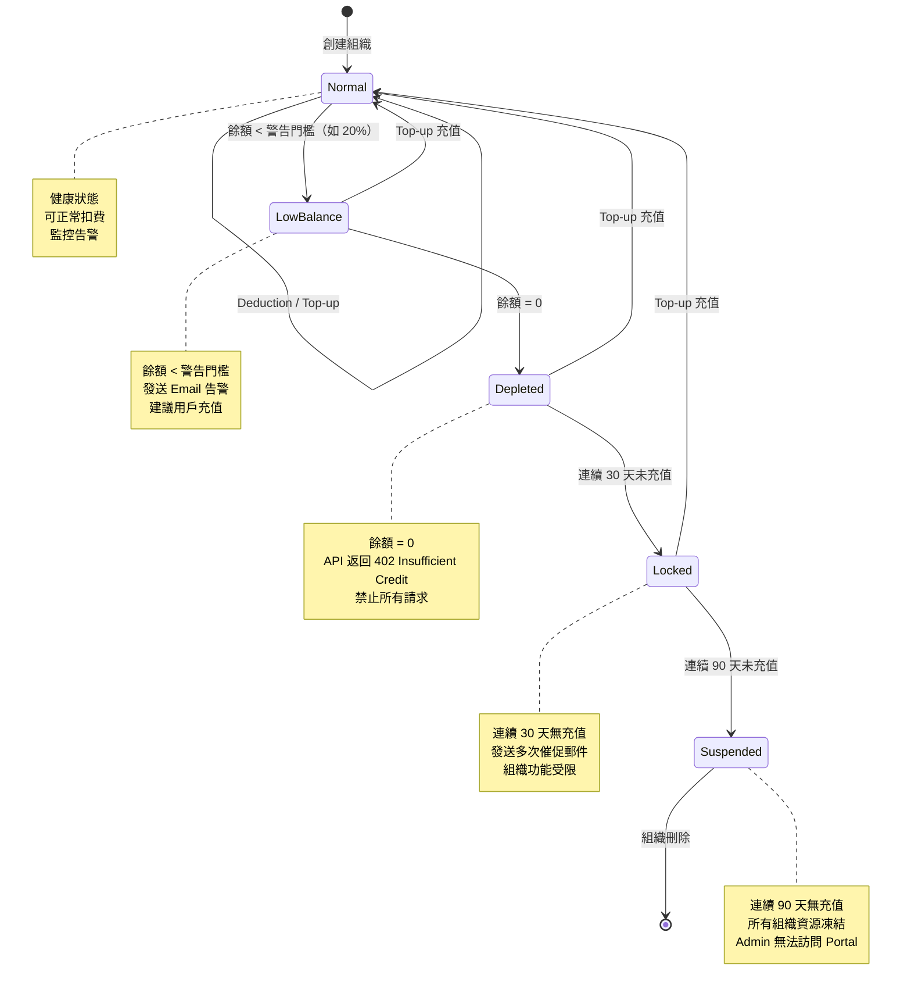
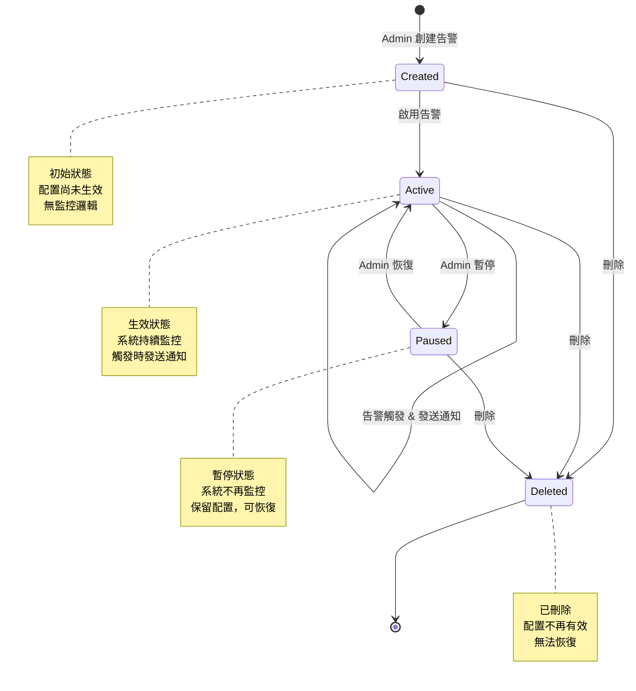
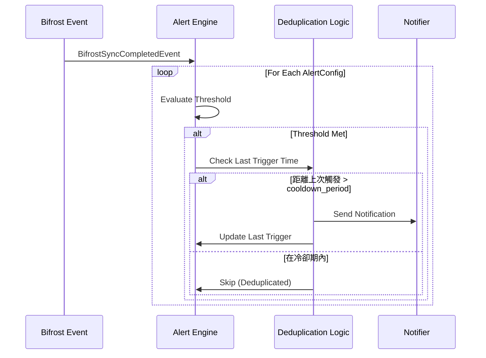
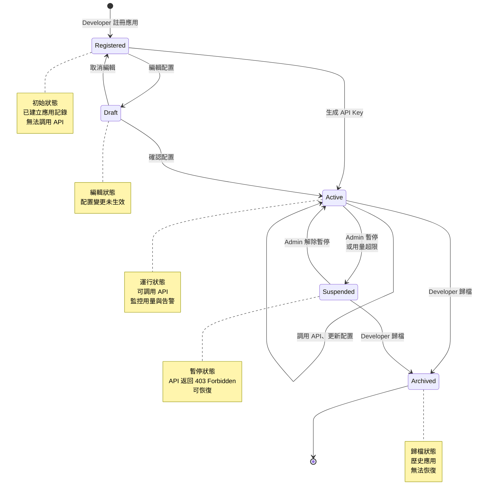
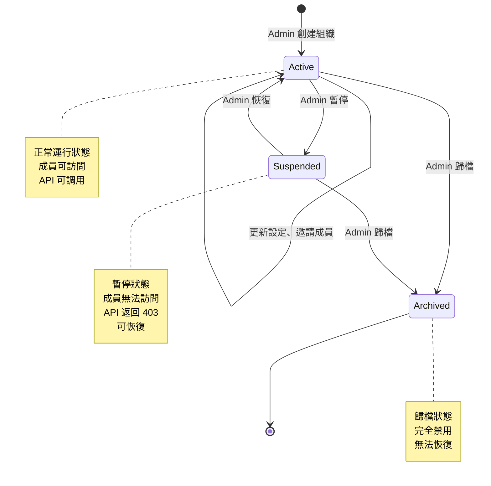

# Draupnir 狀態圖（State Diagrams）

**文檔版本**: v1.0  
**更新日期**: 2026-04-17  
**目的**: 展現關鍵聚合根的生命週期與狀態轉移

---

## 概述

狀態圖展現 Draupnir 中複雜聚合根的狀態機制。每個聚合根都應遵循確定的狀態轉移規則，以確保業務邏輯的一致性與可維護性。

---

## 1. User 聚合根生命週期

### 狀態轉移圖



### 狀態定義表

| 狀態 | 業務含義 | 操作權限 | 轉移條件 | 對應代碼 |
|------|--------|--------|--------|---------|
| **None** | 未註冊 | ❌ 無 | - | `User.status = null` |
| **PendingEmail** | 郵箱待驗證 | ⚠️ 僅登錄 | 提交註冊、驗證郵箱 Token | `User.status = 'pending_email'` |
| **Active** | 已激活 | ✅ 全部 | 驗證郵箱、重新啟用 | `User.status = 'active'` |
| **Deactivated** | 已停用 | ❌ 無 | Admin 停用、用戶刪除請求 | `User.status = 'deactivated'` |
| **Deleted** | 已刪除 | ❌ 無（保留 90 天） | Deactivated 60 天後自動進入 | `User.status = 'deleted'` |

### Domain Event

```typescript
// 狀態轉移時發佈的事件
UserCreatedEvent          // None → PendingEmail
UserEmailVerifiedEvent    // PendingEmail → Active
UserDeactivatedEvent      // Active → Deactivated
UserReactivatedEvent      // Deactivated → Active
UserDeletedEvent          // Active/Deactivated → Deleted
```

### 驗證規則

- **郵箱唯一性** — 每個狀態（除 Deleted）的 User 郵箱必須唯一
- **Active 狀態掃描** — 每日掃描 PendingEmail 狀態超過 24 小時的用戶，轉移至 None（清除）
- **軟刪除保留期** — Deleted 狀態保留 90 天審計日誌，之後硬刪除

---

## 2. Contract 聚合根生命週期

### 狀態轉移圖



### 狀態轉移表

| 當前 | 目標 | 觸發條件 | 影響範圍 |
|------|------|--------|--------|
| Draft | Active | Admin 簽署 | Credit 額度生效、SdkApi 開放 |
| Draft | Cancelled | Admin 取消 | 交易終止 |
| Active | Expiring | 系統掃描：`expiry_date - today ≤ 7` | 發送郵件提醒 |
| Active | Expired | 系統掃描：`expiry_date < today` | API 返回 402、禁止請求 |
| Active | Renewed | Admin 續約 | 新 expiry_date、新額度（可選） |
| Expiring | Expired | 系統掃描：`expiry_date < today` | 同上 |
| Expiring | Active | 續約、更新 expiry_date | 回到 Active，重新計時 |
| Expired | Renewed | Admin 續約 | 重新激活 |
| Renewed | Active | 自動轉移（續約日期到達） | 新合約生效 |

### Domain Event

```typescript
ContractCreatedEvent       // None → Draft
ContractSignedEvent        // Draft → Active
ContractExpiringEvent      // Active → Expiring（定時發佈）
ContractExpiredEvent       // Active/Expiring → Expired
ContractRenewedEvent       // Active/Expired → Renewed
ContractCancelledEvent     // Draft → Cancelled
```

### 關鍵檢查點

```typescript
// Application Service 中的狀態驗證
async deductCredit(apiKey: ApiKey): Promise<void> {
  const contract = await findActiveContract(apiKey.organizationId)
  
  if (!contract) {
    throw new Error('No active contract found')
  }
  
  // ✅ 只有 Active 或 Expiring 狀態可扣費
  if (!['active', 'expiring'].includes(contract.status)) {
    throw new Error(`Contract status ${contract.status} not allowed for deduction`)
  }
  
  // ✅ Expired 狀態拒絕扣費
  const balance = await getBalance(contract.id)
  if (balance.amount <= 0) {
    throw new Error('Insufficient credit')
  }
}
```

---

## 3. CreditAccount 聚合根狀態

### 狀態轉移圖



### 餘額變化時序

```
Time ───────────────────────────────────────→

Balance  
   100 │  ●─────●──────●─────────●──────●
       │  │     │      │         │      │
    80 │  │  ┌──┘      │         │      │
       │  │  │         │    ┌────┘      │
    20 │  │  │      ┌──┘    │           │
       │  │  │      │       │           │
     0 │  │  │      └───────┴───────────┴
       │  │  │
       ↓  ↓  ↓
       Top-up Deduction  Depleted Charged
       
    Events: 
    ● LowBalance Alert (80→20)
    ● Depleted Alert (0)
    ● Normal Recovery (20→100)
```

### 金額計算（ValueObject：Balance）

```typescript
class Balance {
  // 使用 BigInt 避免浮點誤差
  private amount: bigint  // 單位：分（Cent）
  
  static fromString(value: string): Balance {
    // '100.50' → 10050n (分)
    const parts = value.split('.')
    const dollars = BigInt(parts[0])
    const cents = BigInt(parts[1] || '0')
    return new Balance(dollars * 100n + cents)
  }
  
  add(other: Balance): Balance {
    // 返回新實例，不可變
    return new Balance(this.amount + other.amount)
  }
  
  deduct(other: Balance): Balance {
    if (this.amount < other.amount) {
      throw new InsufficientBalanceError()
    }
    return new Balance(this.amount - other.amount)
  }
  
  toDecimal(): string {
    // 10050n → '100.50'
    const cents = this.amount % 100n
    const dollars = this.amount / 100n
    return `${dollars}.${String(cents).padStart(2, '0')}`
  }
}
```

---

## 4. AlertConfig 聚合根狀態

### 狀態轉移圖



### 告警類型與觸發條件

| 告警類型 | 觸發事件 | 條件示例 | 通知接收方 |
|--------|--------|--------|----------|
| **Balance Low** | Bifrost Sync | `balance < 80% of monthly_limit` | Email/Webhook |
| **Balance Depleted** | Credit Deduction | `balance = 0` | Email/Webhook |
| **Contract Expiring** | Daily Scan | `days_until_expiry ≤ 7` | Email |
| **Monthly Limit Reached** | Bifrost Sync | `monthly_usage > limit` | Email/Webhook |
| **API Rate Exceeded** | API Request | `requests/min > threshold` | Email/Webhook |

### 告警觸發與去重邏輯



### 冷卻期設置

```
告警類型                 冷卻期（Cooldown）
─────────────────────────────────────
Balance Low              6 小時
Balance Depleted         24 小時
Contract Expiring        24 小時
Monthly Limit Reached    1 小時
API Rate Exceeded        5 分鐘
```

---

## 5. Application 聚合根狀態（DevPortal）

### 狀態轉移圖



---

## 6. Organization 聚合根狀態

### 狀態轉移圖



---

## 7. 狀態圖使用指南

### 何時使用狀態圖
- ✅ 設計新的聚合根或複雜業務邏輯
- ✅ 驗證狀態轉移的合法性
- ✅ 處理邊界情況（Edge Case）
- ✅ 編寫狀態轉移的測試用例

### 實現模式

#### Pattern 1: Enum 狀態

```typescript
enum UserStatus {
  NONE = 'none',
  PENDING_EMAIL = 'pending_email',
  ACTIVE = 'active',
  DEACTIVATED = 'deactivated',
  DELETED = 'deleted'
}

class User {
  status: UserStatus
  
  verifyEmail(): User {
    if (this.status !== UserStatus.PENDING_EMAIL) {
      throw new InvalidStateTransitionError(
        `Cannot verify email from status: ${this.status}`
      )
    }
    return new User({ ...this, status: UserStatus.ACTIVE })
  }
}
```

#### Pattern 2: State Machine（高級）

```typescript
type UserStateMachine = {
  [key in UserStatus]: {
    canTransitionTo: UserStatus[]
    onEnter?: () => void
    onExit?: () => void
  }
}

const userStateMachine: UserStateMachine = {
  [UserStatus.NONE]: {
    canTransitionTo: [UserStatus.PENDING_EMAIL]
  },
  [UserStatus.PENDING_EMAIL]: {
    canTransitionTo: [UserStatus.ACTIVE, UserStatus.NONE],
    onEnter: () => console.log('Sending verification email')
  },
  [UserStatus.ACTIVE]: {
    canTransitionTo: [UserStatus.DEACTIVATED, UserStatus.ACTIVE],
    onExit: () => console.log('User leaving active state')
  },
  // ...
}
```

### 測試策略

```typescript
describe('User State Transitions', () => {
  it('should transition from PendingEmail to Active on email verification', () => {
    const user = User.create({ email: 'test@example.com' })
    expect(user.status).toBe(UserStatus.PENDING_EMAIL)
    
    const verified = user.verifyEmail()
    expect(verified.status).toBe(UserStatus.ACTIVE)
  })
  
  it('should reject invalid transitions', () => {
    const user = User.create({ status: UserStatus.ACTIVE })
    
    expect(() => {
      user.verifyEmail() // 不能從 ACTIVE 重新驗證
    }).toThrow(InvalidStateTransitionError)
  })
})
```

---

## 相關文檔

- [`entity-relationship-overview.md`](./entity-relationship-overview.md) — 聚合根字段定義
- [`domain-events.md`](../knowledge/domain-events.md) — 狀態轉移時發佈的事件
- [`sequence-diagrams.md`](./sequence-diagrams.md) — 狀態轉移的業務流程
- [`layer-decision-rules.md`](../knowledge/layer-decision-rules.md) — Domain 層設計原則
