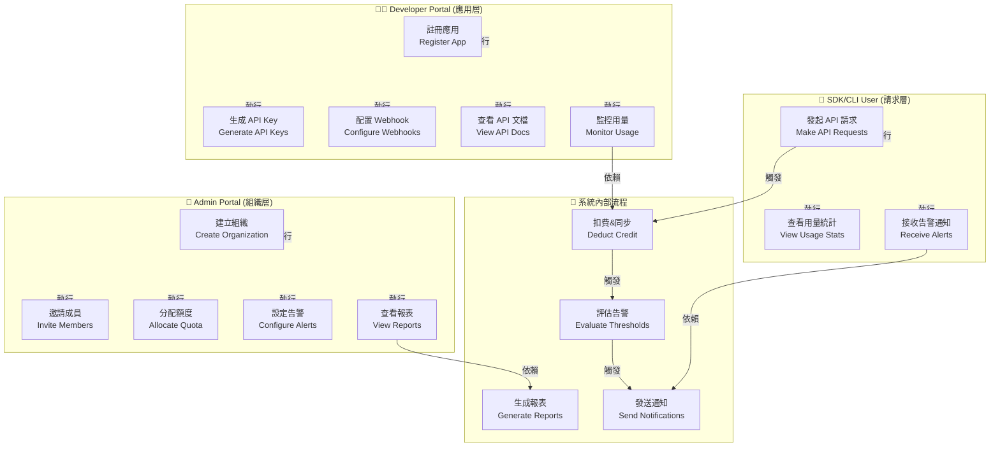

# Draupnir 使用案例圖（Use Case Diagram）

**文檔版本**: v1.0  
**更新日期**: 2026-04-17  
**目的**: 展現系統各角色與主要功能的交互關係

---

## 1. 系統角色（Actors）

| 角色 | 描述 | 典型操作 |
|------|------|--------|
| **Admin** | 平台管理員（組織創建者） | 組織管理、成員邀請、額度分配、告警配置 |
| **Developer** | 開發者（應用註冊者） | 應用管理、API Key 生成、Webhook 配置、用量查看 |
| **End User** | SDK/CLI 使用者（最終消費者） | 調用 API、查看用量、接收告警 |
| **External System** | 外部系統（Bifrost、郵件服務等） | 模型代理、通知投遞 |

---

## 2. 使用案例圖（UML 格式）

---

## 3. 詳細使用案例描述

### 📋 Admin 用例集

#### UC1: 建立組織（Create Organization）
- **角色**: Admin
- **前置條件**: 用戶已登錄
- **主流程**:
  1. 輸入組織名稱、Slug、計費計畫
  2. 系統驗證 Slug 唯一性
  3. 創建組織、默認 CreditAccount、AppModule 訂閱
  4. 返回組織 ID
- **後置條件**: 組織就緒，Admin 成為 Owner
- **相關模組**: Organization, Credit, AppModule

#### UC2: 邀請成員（Invite Members）
- **角色**: Admin
- **前置條件**: 組織存在
- **主流程**:
  1. 輸入成員郵箱、角色（Owner/Manager/Member）
  2. 系統生成加密邀請 Token、發送郵件
  3. 受邀者點擊連結、完成註冊
  4. 自動加入組織，角色按邀請指定
- **後置條件**: 成員可訪問組織資源
- **相關模組**: Organization, Auth, Profile

#### UC3: 分配額度（Allocate Quota）
- **角色**: Admin
- **前置條件**: 組織存在、Credit Account 就緒
- **主流程**:
  1. 指定額度額（Credit）、有效期、模型範圍限制
  2. 系統驗證額度的有效期與計費計畫是否匹配
  3. 創建或更新 Contract
  4. 記錄額度分配審計日誌
- **後置條件**: 額度生效，Dev 可消費
- **相關模組**: Credit, Contract

#### UC4: 設定告警（Configure Alerts）
- **角色**: Admin
- **前置條件**: 組織、Credit Account 存在
- **主流程**:
  1. 設定告警類型（如「月度額度 80% 耗盡」）、接收方（Email/Webhook）
  2. 系統驗證 Webhook 端點（簽名驗證）
  3. 保存告警配置
  4. 告警評估引擎自動監控
- **後置條件**: 告警生效，事件觸發時發送通知
- **相關模組**: Alerts, Credit, Organization

#### UC5: 查看報表（View Reports）
- **角色**: Admin
- **前置條件**: 組織存在
- **主流程**:
  1. 選擇報表類型（日/週/月）、時間範圍
  2. 系統從 Dashboard 讀取已生成的指標
  3. 返回模型消耗、成本、KPI 趨勢
- **後置條件**: Admin 獲得業務洞察
- **相關模組**: Dashboard, Reports

---

### 👨‍💻 Developer 用例集

#### UC6: 註冊應用（Register App）
- **角色**: Developer（必須是某組織成員）
- **前置條件**: Developer 已登錄、組織存在
- **主流程**:
  1. 輸入應用名稱、描述、回調 URI
  2. 系統驗證應用名稱唯一性
  3. 創建 Application 聚合根、分配應用 ID
- **後置條件**: 應用就緒，Dev 可生成密鑰與配置 Webhook
- **相關模組**: DevPortal

#### UC7: 生成 API Key（Generate API Keys）
- **角色**: Developer
- **前置條件**: 應用已註冊
- **主流程**:
  1. 選擇密鑰類型：
     - **ApiKey**: 用戶級密鑰（SDK 調用）
     - **AppApiKey**: 應用級密鑰（服務端調用）
  2. 可選設定 Scope（如僅限 Chat、Embeddings）
  3. 系統生成密鑰、映射至 Bifrost Virtual Key
  4. 返回密鑰（僅顯示一次）
- **後置條件**: 密鑰就緒，可用於 API 認證
- **相關模組**: ApiKey, AppApiKey, Bifrost

#### UC8: 配置 Webhook（Configure Webhooks）
- **角色**: Developer
- **前置條件**: 應用已註冊
- **主流程**:
  1. 輸入 Webhook URL、事件篩選（如 Alert/UsageUpdate）
  2. 系統測試連線、驗證 HMAC 簽名
  3. 保存 Webhook 配置
  4. 配置生效後，符合條件的事件推送至端點
- **後置條件**: Webhook 就緒，應用可接收事件通知
- **相關模組**: DevPortal, Alerts

#### UC9: 查看 API 文檔（View API Docs）
- **角色**: Developer
- **前置條件**: Developer 已登錄
- **主流程**:
  1. 訪問 DevPortal → API 文檔頁面
  2. 系統展示 SDK 的端點、參數、示例代碼
  3. Developer 可根據應用場景複製示例、調整參數
- **後置條件**: Developer 獲得快速集成指導
- **相關模組**: DevPortal

#### UC10: 監控用量（Monitor Usage）
- **角色**: Developer
- **前置條件**: 應用已生成密鑰並發起過請求
- **主流程**:
  1. 訪問 Dashboard、選擇時間範圍
  2. 系統展示該應用的用量統計：模型分佈、Token 消耗、成本預估
  3. 可設定告警閾值（如「日均額度 100」）
- **後置條件**: Developer 掌握實時用量信息，可提前優化
- **相關模組**: Dashboard, Alerts

---

### 🚀 End User 用例集

#### UC11: 發起 API 請求（Make API Requests）
- **角色**: End User（SDK/CLI）
- **前置條件**: 已獲得有效 API Key / App Key
- **主流程**:
  1. SDK 構建請求、在 Header 中附帶 API Key
  2. 請求到達 SdkApi Gateway
  3. Gateway 驗證密鑰 → 檢查組織狀態 → 檢查額度 → 轉發至 Bifrost
  4. 非同步記錄用量、投遞扣費任務
  5. 返回 Bifrost 的響應
- **後置條件**: 請求完成、額度已扣費
- **相關模組**: SdkApi, Auth, Credit, Bifrost

#### UC12: 查看用量統計（View Usage Stats）
- **角色**: End User
- **前置條件**: 已調用過 API
- **主流程**:
  1. SDK 提供用量查詢接口（如 `client.getUsage()`）
  2. 返回本月消耗、額度剩餘、成本預估
- **後置條件**: User 了解自身消耗情況
- **相關模組**: Dashboard, Credit

#### UC13: 接收告警通知（Receive Alerts）
- **角色**: End User
- **前置條件**: Admin 已配置告警、用量觸發閾值
- **主流程**:
  1. 系統監控用量、檢測閾值觸發
  2. 通過 Email/Webhook 發送告警通知
  3. User 收到通知、及時調整使用
- **後置條件**: User 被動防護，避免額度耗盡
- **相關模組**: Alerts, Notifications

---

## 4. 系統內部流程（Support Use Cases）

### UC14: 扣費與同步（Deduct Credit & Bifrost Sync）
- **觸發**: 每次 API 請求完成後
- **流程**:
  1. SdkApi Gateway 投遞「用量扣費」任務至後台隊列
  2. BackgroundService 非同步執行：驗證 API Key → 計算消耗 → 扣除額度
  3. Bifrost 同步完成，投遞 `BifrostSyncCompletedEvent`
  4. 觸發告警評估、報表數據更新
- **相關模組**: Credit, SdkApi, Bifrost

### UC15: 評估告警（Evaluate Thresholds）
- **觸發**: Bifrost 同步完成事件
- **流程**:
  1. Alerts 模組監聽 `BifrostSyncCompletedEvent`
  2. 遍歷組織的全部 AlertConfig、掃描閾值
  3. 若觸發，記錄告警事件、投遞通知任務
  4. 支持多渠道：Email / Webhook
- **相關模組**: Alerts, Credit, Notifications

### UC16: 生成報表（Generate Reports）
- **觸發**: 定時任務（每日/週/月）
- **流程**:
  1. Scheduler 觸發報表生成任務
  2. Reports 服務從 Dashboard 聚合指標：模型分佈、成本趨勢、KPI
  3. 使用 `GeneratePdfService` 將數據渲染為 PDF
  4. 通過郵件服務發送至管理員
- **相關模組**: Reports, Dashboard, Notifications

### UC17: 發送通知（Send Notifications）
- **觸發**: 告警、報表生成、邀請等
- **流程**:
  1. 系統確定通知類型與接收方
  2. 根據配置選擇渠道：Email / Webhook
  3. 構建消息體、簽名驗證（Webhook）
  4. 非同步投遞、記錄投遞結果
- **相關模組**: Alerts, Notifications, DevPortal

---

## 5. 使用案例矩陣

| 功能 | Admin | Dev | EndUser | 涉及模組 |
|------|-------|-----|---------|---------|
| 組織管理 | ✅ | ⭐ | ❌ | Organization |
| 成員邀請 | ✅ | ⭐ | ❌ | Organization, Auth |
| 額度分配 | ✅ | ❌ | ❌ | Credit, Contract |
| 告警配置 | ✅ | ⭐ | ❌ | Alerts |
| 應用註冊 | ❌ | ✅ | ❌ | DevPortal |
| API Key 生成 | ❌ | ✅ | ⭐ | ApiKey, AppApiKey |
| Webhook 管理 | ❌ | ✅ | ❌ | DevPortal |
| API 調用 | ❌ | ⭐ | ✅ | SdkApi, Credit |
| 用量監控 | ⭐ | ✅ | ✅ | Dashboard, Credit |
| 告警接收 | ⭐ | ✅ | ✅ | Alerts |
| 報表查看 | ✅ | ⭐ | ⭐ | Reports, Dashboard |

**圖例**：✅ = 主要使用者，⭐ = 可選使用者，❌ = 不適用

---

## 6. 關鍵設計決策

1. **角色隔離** — Admin/Developer/EndUser 擁有不同的 Portal 和權限邊界
2. **異步觸發** — API 請求、告警評估、報表生成均採用後台異步任務
3. **事件驅動** — Domain Events 驅動跨模組通訊（如 `BifrostSyncCompleted`）
4. **多渠道通知** — 支持 Email / Webhook，滿足不同集成場景

---

**相關文檔**：
- [`ddd-layered-architecture.md`](./ddd-layered-architecture.md) — 模組結構
- [`module-dependency-map.md`](./module-dependency-map.md) — 模組依賴
- [`auth-flow-diagrams.md`](./auth-flow-diagrams.md) — 認證流程
